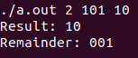

# Divide two numbers as strings in specific base
# Author: Walerij Hrul

The program gets arguments (base, divident, divisor) from terminal while starting program as arguments for main function.
- start point - C
- function of dividing - NASM
Function can divide long numbers represented as char* with base: 1-16

 

##### use 'make tests' to see more examples

#### x86 32-bit architecture (NASM)